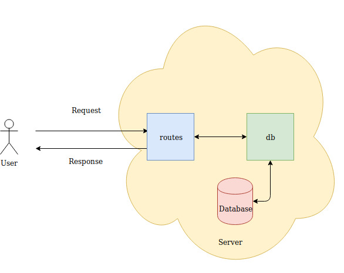

# Example Simple API with Node Postgres + Restify
Simple Example API Rest, using Node, restify, PostgreSQL, Docker and docker-compose.

## Getting Started

First we'll clone the project.

```shell
$ git clone https://github.com/gustafsilva/example-node-postgres.git
```

Open the project and install node dependencies.

```shell
$ cd example-node-postgres
$ npm install
```

Run the database in the container.

```shell
$ cd postgres
$ docker-compose up -d
```

Go back to the initial project folder and run the restify server.
```shell
$ cd ../
$ npm start
```

### Ready! :+1: You can already hack the project :rocket:

## Dependencies
* [Node](https://nodejs.org/)
* [NPM](https://www.npmjs.com/)
* [Docker](https://www.docker.com/)
* [docker-compose](https://docs.docker.com/compose/)

## Database

Single entity of the database:


## Flow of project data.



## Contribution
If you have found an error or want to improve the example, create an `issue` or `pull request`.

## Documentation
You can access the documentation [here](https://gustafsilva.github.io/example-node-postgres/docs/).
Or you can generate locally using the command:

```shell
$ npm run generate-docs
```

Just open the `docs/index.html` file in your browser and start browsing... :green_book:


## Licence
The contents of this repository are covered under the [MIT License](https://github.com/gustafsilva/example-node-postgres/blob/master/LICENSE).